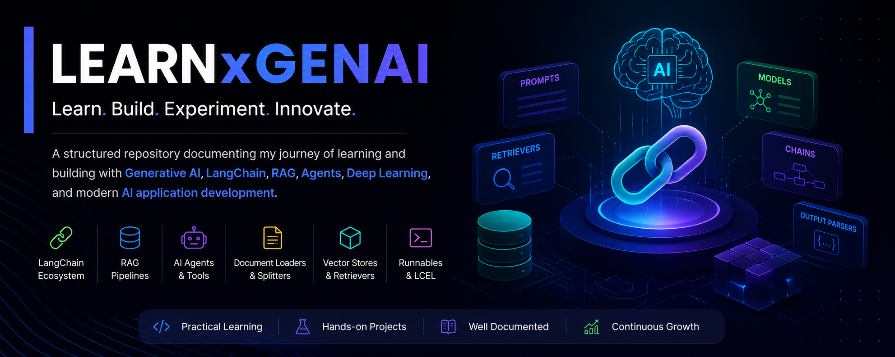

# LEARNxGENAI

<p align="center">
  
</p>

<p align="center">
  A structured repository documenting my journey of learning and building with Generative AI, LangChain, RAG, Agents, Deep Learning, and modern AI application development.
</p>

---

## Overview

LEARNxGENAI is a collection of organized notes, code examples, experiments, and mini-projects created while exploring the GenAI ecosystem.

The goal of this repository is to provide practical, implementation-focused learning resources covering everything from foundational AI concepts to production-ready AI systems.

---

## Repository Structure

```text
LEARNxGENAI
│
├── agentic-ai-langGraph
├── ai-agent
├── assets
├── chains
├── Deep_Learning
├── langchain-model
├── mcp-server
├── output-parser
├── pdf_chatbot
├── rag-pipeline
├── rag-pipeline-project
├── retrievers
├── runnables
├── structured-output
├── tools
│
├── all_topics.md
└── README.md
```

--- 

<h2>Topics Covered</h2>

<ol>
    <li>Foundational Model</li>
    <ul>
        <li>User Prespective</li>
        <li>Builder Prespective</li>
    </ul>
    <li>LangChain</li>
    <ul>
        <li>What is LangChain?</li>
        <li>Why LangChain First?</li>
        <li>LangChain Flow - Fundamentals, RAG, Agents</li>
        <li>Why do we need LangChain?</li>
        <li>Benefits of using LangChain!</li>
        <li>What you can build?</li>
        <li>Alternatives of LangChain!</li>
        <li>LangChain Components</li>
    </ul>
    <li>LangChain - <span style="color: green">Models</span></li>
    <ul>
        <li>What is Models?</li>
        <li>LLMs vs Models</li>
        <li>Types of Models</li>
        <li>Language Model</li>
        <li>Embedding Model</li>
    </ul>
    <li>LangChain - <span style="color: green">Prompts</span></li>
    <ul>
        <li>What is Prompts?</li>
        <li>Static vs Dynamic Prompts</li>
        <li>Prompt Template</li>
        <li>ChatPrompt Template</li>
        <li>Message Placeholder</li>
    </ul>
    <li>LangChain - <span style="color: green">Outputs</span></li>
    <ul>
        <li>All about Outputs!</li>
        <li>Types of Outputs</li>
        <li>Structured Output</li>
        <li>Why do we need structured output?</li>
        <li>Ways to get structured output</li>
        <li>When to use what</li>
        <li>Output Parser</li>
        <li>Types of Output Parser</li>
    </ul>
    <li>LangChain - <span style="color: green">Chains</span></li>
    <ul>
        <li>All about Chains!</li>
        <li>Types of Chain</li>
        <li>Simple Chain</li>
        <li>Sequential Chain</li>
        <li>Parallel Chain</li>
        <li>Conditional Chain</li>
    </ul>
    <li>LangChain - <span style="color: green">Runnable</span></li>
    <ul>
        <li>All about Runnables!</li>
        <li>Why they exist?</li>
        <li>Diff b/w Runnable and Chain</li>
        <li>Types of Runnable</li>
        <li>RunnableSequence</li>
        <li>RunnableParallel</li>
        <li>RunnablePassthrough</li>
        <li>RunnableLambda</li>
        <li>RunnableBranch</li>
        <li>LCEL</li>
    </ul>
    <li>LangChain - <span style="color: green">Document Loader</span></li>
    <ul>
        <li>All about Document Loader!</li>
        <li>Why they exist?</li>
        <li>Text Loader</li>
        <li>PyPDF Loader</li>
        <li>Limitations of PyPDF Loader</li>
        <li>Directory Loader</li>
        <li>Load vs Lazy Load</li>
        <li>Web Based Loader</li>
        <li>CSV Loader</li>
        <li>Custom Docuement Loader</li>
    </ul>
    <li>LangChain - <span style="color: green">Text Splitters</span></li>
    <ul>
        <li>All about Text Splitting!</li>
        <li>Why they exist?</li>
        <li>Types of Splitting</li>
        <li>Length Based</li>
        <li>Text Structure Based</li>
        <li>Document Structure Based</li>
        <li>Semantic Meaning Based</li>
    </ul>
    <li>LangChain - <span style="color: green">Vector Stores</span></li>
    <ul>
        <li>All about vector stores!</li>
        <li>Why vector stores?</li>
        <li>What are vector stores?</li>
        <li>Vector Store v/s Vector Database</li>
        <li>Vector Stores in LangChain</li>
        <li>Chroma Vector Store</li>
        <li>Semantic Meaning Based</li>
    </ul>
    <li>LangChain - <span style="color: green">Retrievers</span></li>
    <ul>
        <li>All about Retrivers!</li>
        <li>Types of Retrievers</li>
        <li>Wikipedia Retriever</li>
        <li>Vector Store Retriever</li>
        <li>MMR - Maximal Marginal Relevance</li>
        <li>Multi Query Retriever</li>
        <li>Contextual Compression Retriever</li>
    </ul>
    <li>LangChain - <span style="color: green">RAG</span></li>
    <ul>
        <li>RAG Fundamentals</li>
        <li>RAG Pipeline Architecture</li>
        <li>Document Processing</li>
        <li>Retrieval Strategies</li>
        <li>Generation Workflow</li>
        <li>End-to-End Implementations</li>
    </ul>
</ol>

---

<h2>Projects</h2>
<p>This repository also contains hands-on implementations including:
    <li>PDF Chatbot
    <li>RAG Pipeline
    <li>End-to-End RAG Projects
    <li>AI Agents
    <li>LangGraph Workflows
    <li>MCP Server Experiments
    <li>Structured Output Systems
</p>

<div>
    <p style="color: red; font-weight: bold;">As I am learning, List will be update every day with new topic's</p>
</div>

---

<h2>Upcoming Topics</h2>
<p>Topics are continuously added as the learning journey progresses. Planned additions include:
    <li>Advanced RAG
    <li>Agentic AI Systems
    <li>Multi-Agent Architectures
    <li>MCP Ecosystem
    <li>Evaluation Frameworks
    <li>Fine-Tuning
    <li>AI Deployment
    <li>Production AI Systems
</p>

<div>
    <h2>Connect & Support</h2>
    <div>Linkedin : <a href="https://www.linkedin.com/in/bansalgagan2004/" style="text-decoration: underline; color: green">https://www.linkedin.com/in/bansalgagan2004/</a>
    </div>
    <div>⭐ If you find this repository useful, consider giving it a star to support future updates and learning resources.</div>
</div> 